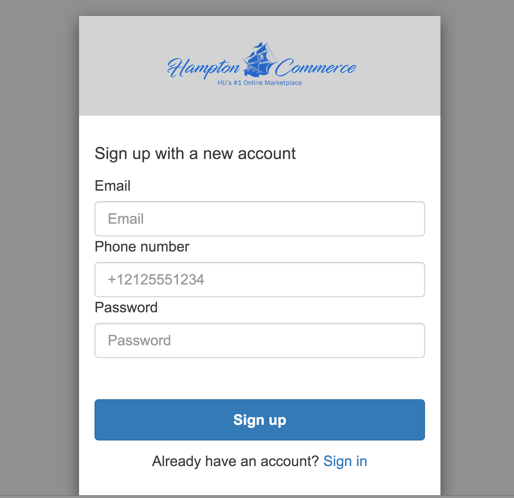
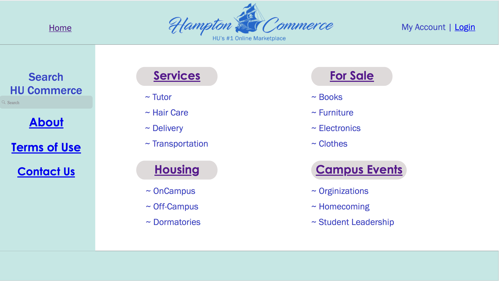
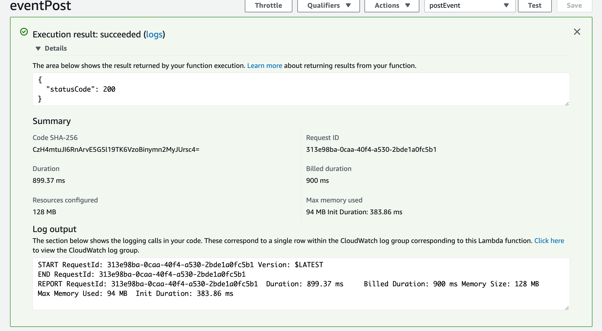
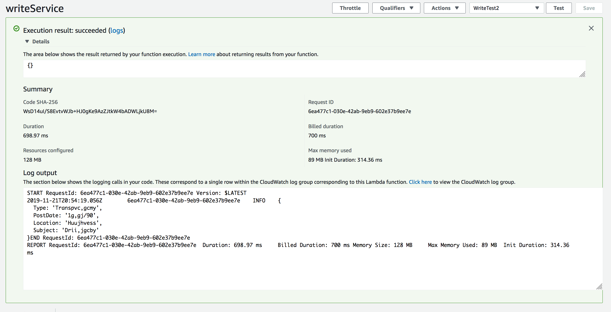
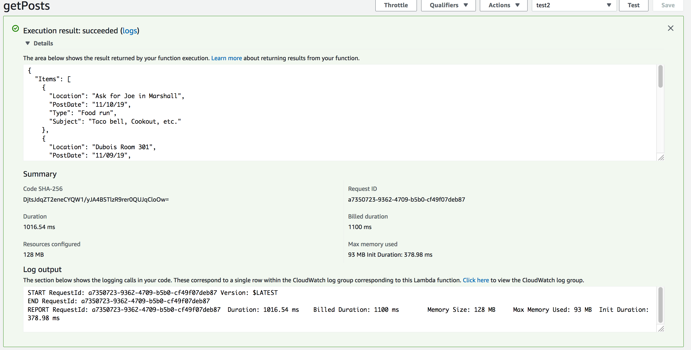
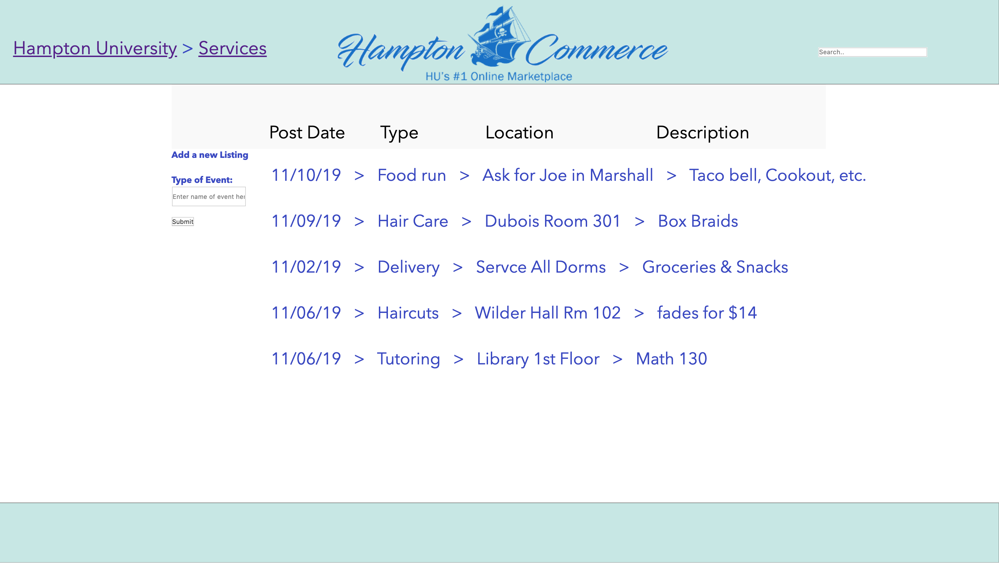
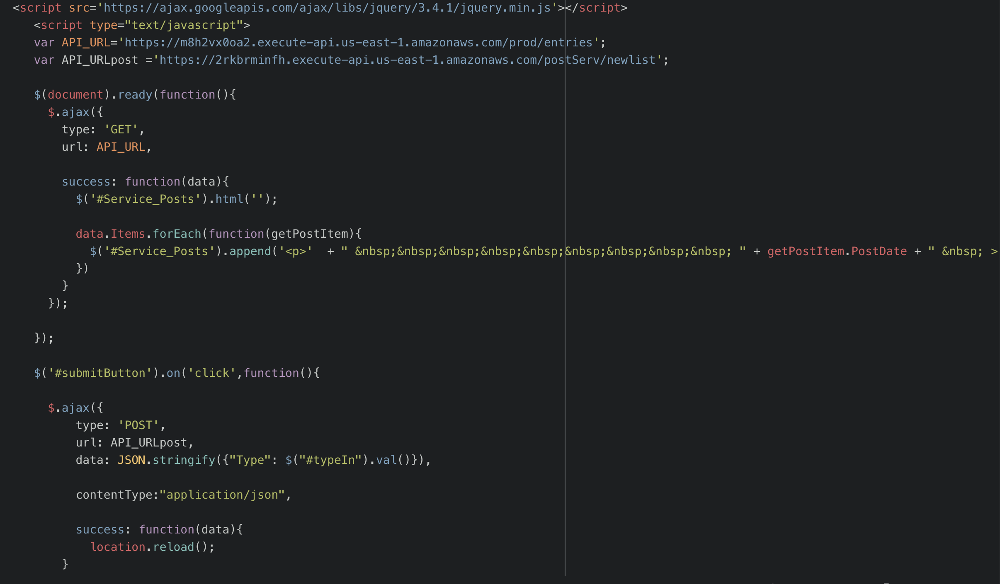

# HU Commerce
Hampton Commerce has been tasked with the assignment to develop the equivalent of craigslist for Hampton University.  The application will be usable only by Hampton University students, staff and faculty but anyone could view the website.  To insure only members of Hampton University have access, the application will require valid Hampton University credentials, which gives users the ability to sell merchandise, buy merchandise or contact the sellers about their products.  The web application will have similar features of craigslist that include information about events going on in the community, products for sale, housing, services like tutoring, job opportunities and discussion forms regarding Hampton University. 

## Table of contents
* [General info](#general-info)
* [Screenshots](#screenshots)
* [Technologies](#technologies)
* [Setup](#setup)
* [Features](#features)
* [Status](#status)
* [Inspiration](#inspiration)

## General info
The scope of this project will be developing a web application specifically for Hampton University that is very similar to craigslist. Hampton Commerce’s website will be completely hosted on Amazon’s AWS through several different components.

## Screenshots

*AWS cognito intial login page

*AWS Cognito Sign-up page

*HUCommerce initial Homepage

*Lambda function test to read from database: PASSED

*Lambda function to write to database: PASSED

*Lambda function to query database

*Services page where youre able to create a new listing

## Technologies
* Github
* Amazon Identity and Access Management
* AWS Cognito 
* Simple Storage Service (S3)
* AWS API Gateway
* AWS Lambda
* DynamoDB

## Setup
Github was used to implement version control. Each member has a respective "branch" in the repository below where thier contributions were located. Repository can be viewed here:
https://github.com/AsanjiC/HUCommerce] 

Amazon Identity and Access Management(IAM)is how we managed access to the same storage, database and application services on the AWS cloud. IAM is how we were able to change permissions for each user, apply API calls and track each users activity within each application service.

Amazon Cognito was implemented for the login page in order to implement two factor authentication via mobile and a token sent to an email verified by our user pool. 

Simple Storage Service (S3) Amazon S3 Bucket and using JavaScript
executed in the browser we will send and receive data from a public backend API built using Lambda and API Gateway.

AWS API Gateway was used to create a public backend API that we could send and recieve data from to see our Lambda functions with.

AWS Lambda was used to correspond to each DynamoDB Table in order to add, read from and query each database.

DynamoDB was used for creating the five databases we needed for each page on HamptonCommerce (Housing, For sale, Campus Events).  

## Code Examples

* Services webpage code example

## Features
List of features ready and TODOs for future development
* Cognito authentication
* Users able to create new listings on respective pages

To-do list:
* Two-way authentication
* Create a page for each listing that provides further information such as photos and soliciter 

## Status
Project is: _in progress
Why?: The to-do's are still the vital part of the website